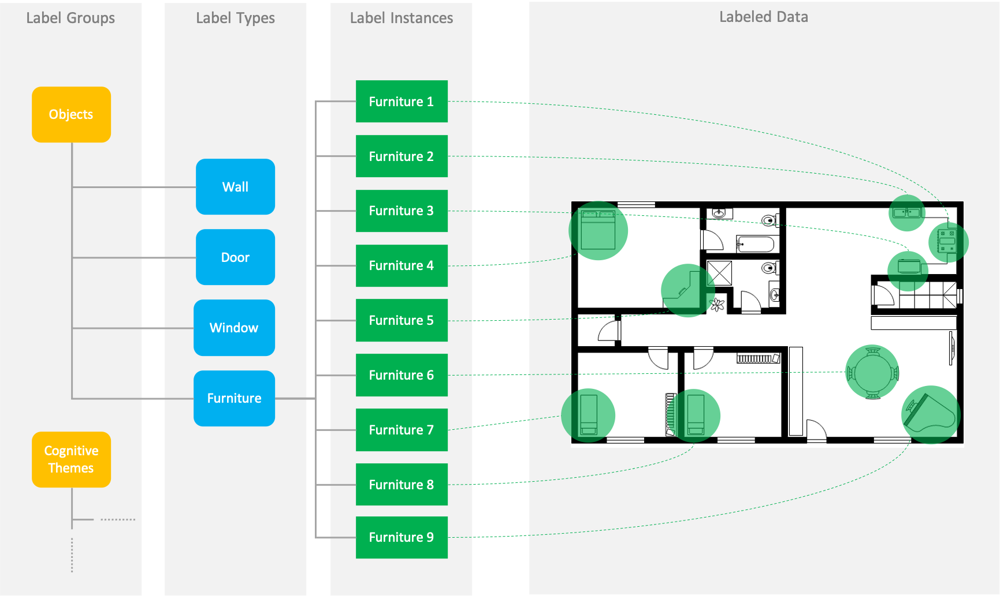

# Sketch Protocol Analyser

A tool to label relations between themes emerging in protocol transcripts and graphic elements in real-time sketch recordings.


This documentation explains:

- [Scope](#scope): purpose the tool 
- [User Interface & Features](#interface-features): basic elements of the graphical ser interface and what you can do with them
- [Usage](#usage): how to use the tool for analysis
- [Install, build, run](#install-build-run): how to setup and run the tool
- [Further Reading](#further-reading): links to documentations on adavanced topics

## Scope

The tool is used in the analysis of retrospective protocol studies that investigate sketch-based design processes. Study participants are given a design task and asked to solve it through sketching. The participants are filmed and the drawing activity is tracked with a digitizer. After completing the task, the participants watch the video recording and are asked to reflect on what they see. A voice recording made in the process is transcribed.

The tool can be used to mark patterns of meaning in the transcript. Emerging themes can be assigned to different categories (labels). Graphic elements in the sketch can be assigned to a marked theme in the transcript. This should enable a later analysis of the correlation between themes and their graphic representation. This shall provide information about a possible relationship between cognitive states in the design process and measurable properties of the sketch. 

The tool was developed for the analysis of sketches of early conceptual architectural design. The analysis should help answering the question of whether there are graphic elements in the sketches that convey information about the designer's feelings about their design or their reasoning during the design process.

## Interface and Features

The following figure shows the main components of the graphical user interface of the labeling tool.


- The **Menu Launcher** opens dialogues for loading existing sessions or creating new sessions (see [Setup or Load Session](#setup-or-load-session)).
- The **Session Name** display shows the name of the participant session currently loaded into the tool.
- The two **Video Player**s show video recordings of the task and the retrospective relection respectively
- The **Transcript** section has two tabs, one for a transcript of patricipants think aloud comments during the design task and one for  a transcript of the participant's reflection.
- The **Sketch** is an interactive representation of the participant's sketch. Properties of individual sample values can be accessed by hovering sample points with the mouse pointer. The contact pressure of the pen at individual samples is encoded in greyscales.
- The **Play Back Controls** allow you to control the playback of the data (video, transcript and sketch). The transcript scrolls synchronously with the video. The Sketch display progresses simultaneously with the sketch in the video.
- The **Sketch Rotate** button allows you to rotate the sketch by 90°.
- The **Offset Timing Control** allows adding a negative or positive delay to the clock that drives the timed presentation of the interactive sketch representation. This allows earlier or later start of the playback of the sketch data and to sync the playback with the video recording of design task solution process.
- The **Sketch Selection Mode Controls** allow you to set the selection mode
- The **Labeler** section includes expansion panels for different groups of labels. An expension panel for a group includes two tabs: one for label types and one for instances of label types (see [Labeling](#labeling)).
- **Label Controls** allow the configuration of the visibility of labelled data ("`+`" for highlight, "`-`" for invisible) as well as the deletion of label types and label instances ("`x`"). Actions on a label type affect all instances of the type. For example, if a label type is deleted, all label instances of that label type are also deleted (see [Labeling](#labeling)).


## Usage

This section describes how to use the tool: [what format the data must have](#prepare-data), [how to load the data into the tool](#setup-or-load-session) and [how to label data](#labeling).

### Prepare Data

>**Note**: In the current version, no format check is performed by the tool. You must ensure compatibility with the following data formats yourself. If your data does not comply with the format, the tool will probably behave erroneously.

The tool requires the following data:
- [Sketch](#sketch): a JSON file with the digital representation of the sketch
- [Transcript](#transcript): two JSON-Files, with the transcript data of think aloud comments during the design task solution process and with transcript data of the retrospective reflection
- [Labels](#labels): a JSON-File with the default label  
- [Video](#video): two video files: one with the recording of the experiment and one with the recording of the retrospective reflection
- [Correlations](#correlations): a JSON file that describes changes in the playback state of the recording of the design task solution process during the recording of the retrospective reflection.

#### Sketch

The sketch is encoded as a JSON array. The array contains a list of strokes that make up the sketch. The strokes are in turn represented by arrays containing a list of points. A point is represented by the following information:

- `x` coordinate
- `y` coordinate
- `p` pen pressure
- `t` time in miliseconds when the pen sample was recorded

**Example**: Extracted from the example file [example_sketch.json](src/assets/example_sketch.json)

```json
[
  [
    {
      "x": 102,
      "y": 564,
      "p": 1129,
      "t": 10728 
    },
    {
      ...
    },
    ...
  ],
  [
    ...
  ]
]
```

#### Transcript

The transcript file contains a JSON object with the following properties:

- `meta`: object that contains descriptive metadata about the transcript. Includes:
  - `speakers`: a list of speaker objects containing information about the speakers in the scene. These are:
    - `id`: unique identifier of the speaker
    - `name`: name of the speaker
  - `duration`: temporal length of the transcribed scene
- `data`: list of word objects. A word object has the following properties:
  - `text`: textual content of the word
  - `time`: time in milliseconds at which the word was spoken
  - `speaker`: unique identifier of the speaker (see`meta`)


**Example**: Extracted from the example file [example_transcript.json](src/assets/example_transcript.json)

```json
{
  "meta": {
    "speakers": [
      { "id": "s1", "name": "Interviewer" },
      { "id": "s2", "name": "Participant" }
    ],
    "duration": 90000
  },
  "data": [
    { "text": "Loremipsum", "time": 0, "speaker": "s1" },
    ...
  ]
}
```

#### Labels

The label file determines which label types are initially available in which label groups. Label types can be added later via the graphical user interface. The label file contains a JSON array of label group objects. 

A Label Group object has the following properties:

- `id`: Unique identifier of the label group. The label group identifier is a Uniform Resource Name (URN) and is structured as follows: `urn:sketch:label:<unique-group-name>`
- `name`: name of the group as displayed in the graphical user interface
- `types`: list of label type objects that are assigned to the label group. A label type object has the following properties:
  - `id`: unique identifier of the label type. The label type identifier is a URN and is composed of the URN string of the group ID and an identifier unique within the group: `<group-id-urn-string>:<label-typ-id>`
  - `name`: name of the label type as displayed in the graphical user interface

**Example**: content of sample file [example_labels.json](src/assets/example_labels.json)

```json
[
  {
    "id": "urn:sketch:label:object",
    "name": "Objects",
    "types": [
      { "id": "urn:sketch:label:object:type:1", "name": "room" },
      { "id": "urn:sketch:label:object:type:2", "name": "wall" },
      { "id": "urn:sketch:label:object:type:3", "name": "door" },
      { "id": "urn:sketch:label:object:type:4", "name": "window" },
      { "id": "urn:sketch:label:object:type:5", "name": "furniture" }
    ]
  },
  {
    "id": "urn:sketch:label:theme",
    "name": "Cognitive Themes",
    "types": [
      { "id": "urn:sketch:label:theme:1", "name": "analysis" },
      { "id": "urn:sketch:label:theme:2", "name": "synthesis" },
      { "id": "urn:sketch:label:theme:3", "name": "evaluation" }
    ]
  }
]
```

#### Video

A video file containing a recording of how the participant solves the drawing task. The tool was tested with `mp4` video. The video should be available in this format. If the video is not in the appropriate format, the freely available tool [Handbrake](https://handbrake.fr/) can be used for transcoding.

The videos players are in the [GUI](#interface-and-features) relatively small (320x240). The videos should not have a larger resolution, as this unnecessarily ties up computing capacity. The coding profile ("*Preset*") "*Discord Tiny*" in Handbrake, for example, has proven to be suitable.

#### Correlations

During the recording of the retrospective reflection, the recording of the solution process may have to be paused, e.g. because a participant wants to talk in more detail about a graphic element in the sketch. A JSON file, in the format shown in the example below, tells the analysis tool at which points in the recording of the retrospective reflection the temporal relationship between the two recordings changes and how. During the later playback in the analysis tool, these changes in the temporal relation can be taken into account. For example, the first video can be stopped if it was stopped during the second recording. Related events are presented in sync.

**Example**: Extracted from the example file [example_correlations.json](src/assets/example_correlations.json)

```json
[
  {
    "tx": 3537,
    "sx": 1,
    "ty": 0,
    "sy": 1,
    "ey": "play"
  },
  ...
]
```

The recording tool [Protocol Recorder](https://github.com/KSD-research-group/protocol-recorder) can be used to create video recordings of the solution process and reflection. It also automatically creates the file with the correlation changes in the required format.

### Setup or load session

You have already [prepared your data](#prepare-data). Here you learn how to [load data into the tool](#create-a-new-session). Once you have done this, you can start [labelling](#labeling). You can interrupt your work at any time. The tool saves all changes you make. If you want to continue your work, you can simply [reload the session into the tool](#open-an-exisiting-session).

#### Create a new session

To create a new session:

- Click on the Menu Launcher &rarr; the menu opens
- Select "New session" &rarr; the "Create Session" dialogue opens. You can enter all the necessary information in the form.
  - Enter the name of the participant session in the text field, e.g. the real name of the participant "John Doe" or anonymised "Participant 1".
  - For each of the necessary files (sketch, label, transcript, video):
    - Click on the file upload icon next to the file type name &rarr; the file selection dialogue opens.
    - Select the appropriate file and click on "open" &rarr; the selection dialogue closes, session configuration dialogue reappears and the name of the selected file appears in the form
  - The "Create" button is active as soon as you have selected all files. Click the "Create" &rarr; a working copy of the files will be uploaded to the server. Once this process is complete, the "Create" button turns into an "Apply" button.
  - Click "Apply" &rarr; the session gets loaded. You can start [labeling](#labeling)


#### Open an exisiting session

To load an existing session:

- Click on the Menu Launcher &rarr; the menu opens
- Select "Open session" &rarr; the session gets loaded. You can start [labelling](#labeling)


### Labeling

Having [preapared the data](#prepare-data) and [created](#create-a-new-session) or [loaded](#open-an-existing-session) a session you can start labeling the data. Before the typical [workflow for labelling](#workflow) is presented, the concepts of label group, label type and label instance are introduced.

#### Label Group, Label Type and Label Instance

The Labeler section in the [graphical user interface](#interface-and-features) is divided into thematic groups. Different label types are assigned to a label group. The assignment of a data set to a label type is done via label instances. Label instances are concrete realisations of a label type. There can be several instances of a label type in a labelled data set. The connection between label groups, types and instances is made more clear in the following example.

**Example**: The figure below illustrates the concept of label groups, types and instances. In the example, like in the screenshot of the [graphical user interface](#interface-and-features), there are the label groups "Objects" and "Cognitive Themes". The label types of the group "Objects" are used to assign elements in the data set (here a computer-rendered floor plan instead of a freehand drawing) to classes of physical objects in the floor plan: "Wall", "Door", "Window", "Furniture". All objects of the type "Furniture" were labelled. A label instance is created for each labelled element in the sketch. These are named "Furniture 1", "Furniture 2", etc.




#### Workflow

There are three ways to tag your data with the labelling tool. The way you label your data depends on the question you want to answer with the labelled data. You can:

1. **Label text passages**: For some questions, you may only want to qualitatively analyse what is spoken by the study participants (e.g. [Thematic Analysis](https://en.wikipedia.org/wiki/Thematic_analysis)). In these cases, you can use the tool to mark relevant text passages and assign labels to them.
2. **Label elements in the sketch**: you may want to investigate how certain objects (walls, doors, windows, certain furniture) are represented in architectural hand sketches. In such cases, you can tag the corresponding elements in the sketch in order to later compare different representations associated with a label type.
3. **Assigning sketch elements to label instances in the transcript**: in order to investigate relationships between themes in the participants' statements and elements in the drawing

To **label text passages**:

- Mark the text passage you want to label
- Open the expansion panel of the label group containing the label type you want to assign.
- Click on the label type you want to assign &rarr; the corresponding label instance appears in the instance tab of the label group. To the right of the paragraph of the labelled text, a chip button appears that also represents the label instance.

To **label elements in the sketch**:

- Make a selection
  - Select the elements of the sketch that you want to label. There are three tools available for this. You can select a tool via the [Sketch Selection Mode Controls](#interface-and-features):
    - *Sample*: click on a point to select the corresponding sample of the sketch.
    - *Stroke*: click on a stroke to select all samples corresponding to that stroke
    - *Brush*: click in the sketch and drag the mouse pointer. A rectangle appears. All samples within the rectangle are selected.
  - You can unselect selected elements by selecting them again.
  - You can extend a selection as you wish by selecting further elements.
- Assign a label: you have two options:
  - If you want to create a new label instance for the selected elements (see 2.), click on a label type button.
  - If you want to assign the marked elements to an existing label instance (see 3.), e.g. a label instance that is already assigned to a text section, you have two options:
    - Click on the label instance in the instance tab of the correspinding label group in the Labeler section.
    - Click on the chip button of the instance next to the corresponding paragraph in the transcript

The [Label Controls](#interface-and-features) allow you to manage your label types and instances and to influence the display of the labelled data.

**Create new label types** as follows:

- Open the expansion panel of the corresponding label group.
- Open the label type tab
- Click on the text input field "New type"
- Enter name for the new label type
- Hit Enter &rarr; a new chip button with the name appears in the list of label types. You can now create label instances of this type.

**Delete label types** as follows:

- Öffnen Sie das Erweiterungsfeld der entsprechenden label group.
- Open the label type tab
- Click on the "`x`" button of the corresponding label type chip button &rarr; the label type is being deleted. **Caution**: all instances of this label type will be deleted and all instances of this type will be removed from the data. This cannot be undone. If the deletion was an error, you have to recreate the label type and relabel the corresponding data.

There are to ways to **delete label instances**:

- Via the label instance list in the Labeler section:
  - Open the expansion panel of the corresponding label group.
  - Open the label instance tab
  - Click on the "`x`" button of the corresponding label instance button &rarr; the label instance is being deleted. 
- Via the label instance chip buttons in the Transcript section
  - Click on the "`x`"-button of the chip button of the desired label instance &rarr; the label instance is being deleted. 

**Highlight data assigned to a specific label type** as follows:

- Öffnen Sie das Erweiterungsfeld der entsprechenden label group.
- Open the label type tab
- Click on the "`+`" button of the corresponding label type chip button &rarr; All data that is a assigned a label of this type is highlighted. Text is underlaid in colour. Points in the sketch appear in a bright blue.

**Highlight data assigned to a specific label instance** as follows:

- Öffnen Sie das Erweiterungsfeld der entsprechenden label group.
- Open the label instance tab
- Click on the "`+`" button of the corresponding label instance button  &rarr; All data that has been assigned this label instance is highlighted. Text is underlaid in colour. Points in the sketch appear in a bright blue.

**Hiding labelled elements in the sketch** can be helpful if already labelled elements overlay other elements, or simply to make the sketch clearer. You can hide labelled elements in the sketch by label instance or label type by following the same procedure as for highlighting (see above) and clicking on "`-" instead of "`+".


## Install, build, run

In this section you will learn how to install the tool on your machine and how to start it. Before following the instructions below, make sure that the following requirements are met.

**Prerequisites**:

- [Node.js](https://nodejs.org/en/): you have a current version of Node.js including the package manager NPM and the package runner NPX installed on your system.
- [Git Client](https://git-scm.com/downloads): you have a Git client installed on your system, with which you can access the repository
- Access Rights: you have the necessary access rights to the Git project, ideally via [SSH](https://docs.gitlab.com/ee/ssh/)

**Installation**:

You only have to carry out the installation process once

1. Open a terminal window
2. Change to the directory in which you want to install the app
```bash
cd <path/to/install/dir>
```

3. Clone this repository
```bash
git clone <repository-url>
```

4. Change to the project directory
```bash
cd sketch-protocol-analyser
```

5. Install project dependencies
```bash
npm install
```

**Build**:

You only need to do this step the first time after installation or after you have made changes to the sources in the [/app](/app) directory or if you have pulled updates to the files in that directory via `git pull`.

6. Build app
```bash
npx ng build
```

**Run**:

You must perform this step every time you want to start the app, e.g. after installation and build, after restarting your computer or after you have closed the app manually.

7. Run
```bash
npm start
```

This will start a Node.js service which serves the client app code and provides an API for user session managament and storage. You can access the client at [http://localhost:3000](http://localhost:3000). The tool was tested in Google's [Chrome browser](https://www.google.com/intl/de_de/chrome/).

To terminate the service hit `[ctrl]+[c]`.


### Development mode

If you want to make changes to either the client app or server code you might find it handy to run them in development mode. The development server of the client app, rebuilds the app each time you apply changes to its source. Similarly, the server in development mode is restarted each time you make changes to its source, in order for changes to take effect.

**Run client app in development mode**:

```bash
npx ng serve
```

The client app will now be availble at [http://localhost:4200](http://localhost:4200). Hit `[ctrl]+[c]` to terminate.

**Run Node.js service in development mode**:

```bash
npx nodemon src/server/server.js
```

Hit `[ctrl]+[c]` to terminate.


## Further Reading

- [Session Data](doc/session-data.md): Learn where results of labeling sessions are stored and what format the data has
- [Implementation](doc/implementation.md): main software components and their interplay
- [Future Releases](doc/future-releases.md): technical considerations for future versions of the tool
