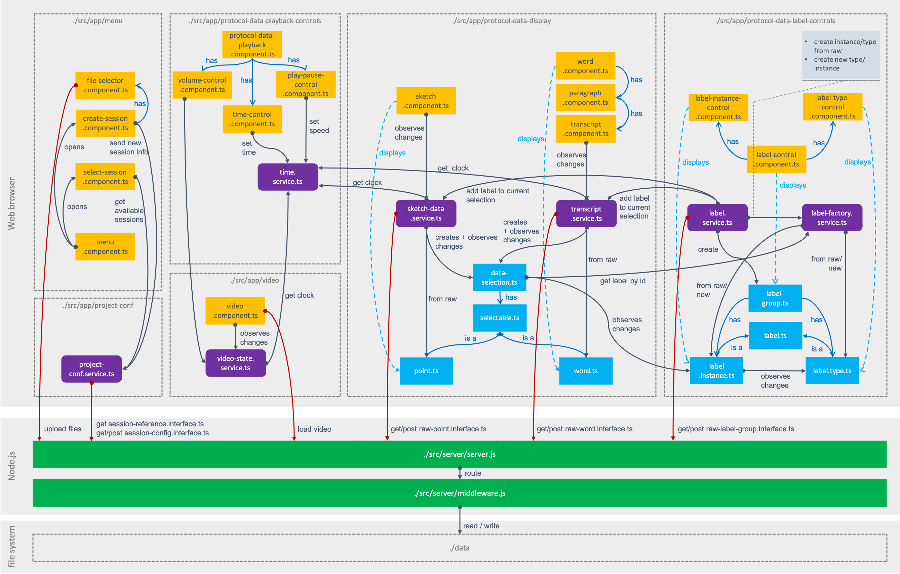
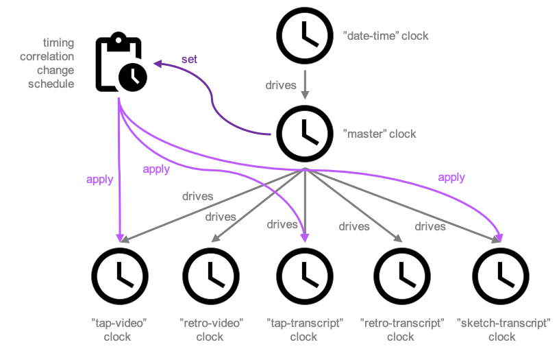

# Implementation

This section highlights some aspects of the technical implementation. First, it explains [architectural](#software-architecture) concepts, the main components of the software and how they interact with each other. Then we look at how the different media elements of the application are [synchronised](#media-synchrionisation) with each other.

## Software architecture

The following figure illustrates the components of the software and their interaction. Software consists of two sub-applications, a server application and a client application. The client application runs in a web browser and is based on the framework [AngularJS](https://docs.angularjs.org/guide) with the styling framework [Angular Material](https://material.angular.io/). The server application is based on [Express](https://expressjs.com/) and runs in a Node.js runtime. The server application is used to provide and store the application data (transcript, sketch, labels, video). The server code essentially consists of two JavaScript files [server.js](../src/server/server.js) and [middleware](../src/server/middleware.js). The code in `server.js` defines the API endpoints of the server as [express routes](https://expressjs.com/en/guide/routing.html). The file `middleware.js` contains the implementation of the corresponding application logic, e.g. for creating configurations for new participant sessions or for saving and reading data from the file system. Data is stored directly in the file system. This means that all application components can run on the user machine without having to install a database. The tool can be used independently of a connection to the Internet, as all data is stored locally.

The main complexity of the software is in the client application. The architecture diagram shows the most important elements. The architecture of the client application uses the Angular concepts [Components](https://angular.io/guide/component-overview) and [Services](https://angular.io/guide/dependency-injection). Services are shown as purple rectangles with round corners, with the names of the corresponding source files which end with `*.service.ts`. Services perform more extensive background operations, process data and handle communication with the server (with the exception of `file-selector.component.ts` and `video.component.ts`). Components are shown as orange rectangles in the diagram. Components define elements of the graphical user interface, map data to those elements and handle user input – typically by passing input data to services or triggering service actions. A component has four files:

- The template `*.component.html` which declares what renders on the page 
- The stylesheet `*.component.css` which defines the styles applied to the template
- The typescript class `*.component.ts` which defines the behaviour. Im Diagram stehen die `*.component.ts` Files stellvertretend für die beiden anderen Files.
- Unit test specifcations `*.component.spec.ts`. *Currently no proper unit tests pactually implemented*

The diagram shows the following services:

- [project-conf.service.ts](../src/app/project-conf/project-conf.service.ts)
- [time.service.ts](../src/app/protocol-data-playback-controls/time-control/time.service.ts)
- [video-state.service.ts](../src/app/video/video-state.service.ts)
- [sketch-data.service.ts](../src/app/protocol-data-display/sketch/sketch-data.service.ts)
- [transcript.service.ts](../src/app/protocol-data-display/transcript/transcript.service.ts)
- [label.service.ts](../src/app/protocol-data-label-controls/label.service.ts)
- [label-factory.service.ts](../src/app/protocol-data-label-controls/label-factory.service.ts)

The diagram shows the following components:

- [menu.component.ts](../src/app/menu/menu.component.ts)
- [create-session.component.ts](../src/app/menu/create-session/create-session.component.ts)
- [file-selector.component.ts](../src/app/menu/create-session/file-selector/file-selector.component.ts)
- [select-session.component.ts](../src/app/menu/select-session/select-session.component.ts)
- [protocol-data-playback.component.ts](../src/app/protocol-data-playback-controls/protocol-data-playback-controls.component.ts)
- [volume-control.component.ts](../src/app/protocol-data-playback-controls/volume-control/volume-control.component.ts)
- [time-control.component.ts](../src/app/protocol-data-playback-controls/time-control/time-control.component.ts)
- [playpause-control.component.ts](../src/app/protocol-data-playback-controls/playpause-control/playpause-control.component.ts)
- [video.component.ts](../src/app/video/video.component.ts)
- [sketch.component.ts](../src/app/protocol-data-display/sketch/sketch.component.ts)
- [transcript.component.ts](../src/app/protocol-data-display/transcript/transcript.service.ts)
- [paragraph.component.ts](../src/app/protocol-data-display/transcript/paragraph/paragraph.component.ts)
- [word.component.ts](../src/app/protocol-data-display/transcript/word/word.component.ts)
- [label-control.component.ts](../src/app/protocol-data-label-controls/label-control/label-control.component.ts)
- [label-instance-control.component.ts](../src/app/protocol-data-label-controls/label-control/label-instance-control/label-instance-control.component.ts)
- [label-type-control.component.ts](../src/app/protocol-data-label-controls/label-control/label-type-control/label-type-control.component.ts)

In addition to Services and Components, a number of helper classes are shown in blue rectangles. These are:

- [data-selection.ts](../src/app/protocol-data-display/selection/data-selection.ts)
- [selectable.ts](../src/app/protocol-data-display/selection/selectable.ts)
- [point.ts](../src/app/protocol-data-display/sketch/point.ts)
- [word.ts](../src/app/protocol-data-display/transcript/word/word.ts)
- [lable.group.ts](../src/app/protocol-data-label-controls/label-group.ts)
- [lable.ts](../src/app/protocol-data-label-controls/label-control/label.ts)
- [lable-type.ts](../src/app/protocol-data-label-controls/label-control/label-type-control/label-type.ts)
- [lable-instance.ts](../src/app/protocol-data-label-controls/label-control/label-instance-control/label-instance.ts)

## Media Synchronisation

The media elements of the application (video players, transcripts elements and the interactive visualisation of the sketch) are synchronised with each other. This is to make it easier for users to find relations between the contents of the different elements. The synchronisation is conceptually based on a hierarchy of clocks. Each media element has its own clock, which in turn follows a master clock. The master clock is derived from the system time. The relative position of the master clock to the system time (playback position from the user's point of view) is controlled by the user via the [playback controls](#interface-and-features). The [correlation changes](#correlations) recorded during the recording of the retrospective reflection are applied via event schedules that are bound to the master clock.

The concept of software clocks is inspired by the project [dvbcss-clocks](https://github.com/bbc/dvbcss-clocks/). The implementation was heavily simplified to aspects necessary for the use case. The implementation of the clocks includes the following modules:

- [clock.ts](../src/app/protocol-data-playback-controls/time-control/clocks/clock.ts): base class for clocks
- [date-clock.ts](../src/app/protocol-data-playback-controls/time-control/clocks/date-clock.ts): clock derived from the system time
- [correlated-clock.ts](../src/app/protocol-data-playback-controls/time-control/clocks/correlated-clock.ts): vclock derived from another clock (e.g. `DateClock`). The "master" clock is, for example, a `CorrelatedClock` whose parent clock is a `DateClock`. Their temporal correlation is described via a `Correlation` object. The correlation is controlled by the user via the [Playback Controls](#interface-and-features).
- [correlation.ts](../src/app/protocol-data-playback-controls/time-control/clocks/correlation.ts): describes the temporal relationship between clocks
- [offset-clock.ts](../src/app/protocol-data-playback-controls/time-control/clocks/offset-clock.ts): a `CorrelatedClock` that can be moved on the time axis in relation to the parent clock by a time offset.
- [schedule.ts](../src/app/protocol-data-playback-controls/time-control/clocks/schedule.ts): an event schedule that can be bound to a clock and triggers function calls at specified times.

The different media elements have different strategies to align with the time of the clock assigned to them. Video elements use [video-synchroniser.ts](../src/app/protocol-data-playback-controls/video/video-synchroniser.ts). The 'VideoSynchroniser' checks the current time on the assigned media clock at a set interval or when the correlation changes (e.g. user presses pause) and adjusts the playback position of the video accordingly. Two strategies are used to adjust the position. For large deviations (`>1s`), it seeks to the corresponding position. For smaller deviations, the playback speed is changed until the video position catches up with the time on the clock. The transcript elements use [schedule.ts](../src/app/protocol-data-playback-controls/time-control/clocks/schedule.ts) to scroll to the appropriate paragraph at given times. The interactive visualisation of the sketch uses the tick function of [correlated-clock.ts](../src/app/protocol-data-playback-controls/time-control/clocks/correlated-clock.ts) to update the display at a specified interval.

## Next

You may be interested in reading:

- [Future Releases](future-releases.md): technical considerations for future versions of the tool
